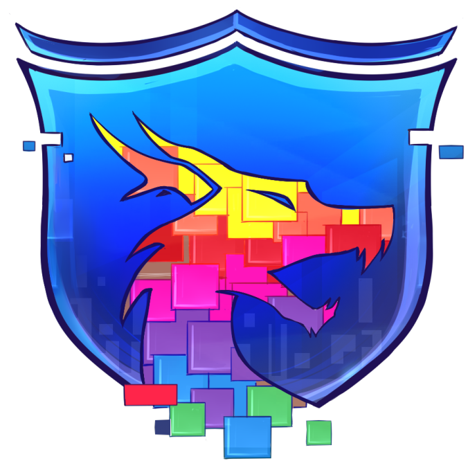

<p align="center"></p>

<h1 align="center">Lectron Universe</h1>

<em><h5 align="center">(for mc.lectron.com Minecraft server)</h5></em>

[<p align="center">](https://travis-ci.org/lectron/lectronlauncher) [](https://github.com/lectron/launcher/releases) </p>

<p align="center">Join modded servers without worrying about installing Java, Forge, or other mods. We'll handle that for you.</p>


## Features

* 🔒 Full account management.
  * Add multiple accounts and easily switch between them.
  * Credentials are never stored and transmitted directly to Mojang.
* 📂 Efficient asset management.
  * Receive client updates as soon as we release them.
  * Files are validated before launch. Corrupt or incorrect files will be redownloaded.
* ☕ **Automatic Java validation.**
  * Java is a dependency that helps you run this application correctly.
  * If you have an incompatible version of Java installed, we'll install the right one *for you*.
  * You do not need to have Java installed to run the launcher.
* 📰 News feed natively built into the launcher.
* ⚙️ Intuitive settings management, including a Java control panel.
* Supports all of our servers.
  * Switch between server configurations with ease.
  * View the player count of the selected server.
* Automatic updates. That's right, the launcher updates itself.
*  View the status of Mojang's services.

This is not an exhaustive list. Download and install the launcher to gauge all it can do!

#### Need Help? [Check the wiki.][wiki]

#### Like the project? Leave a ⭐ star on the repository!

## Downloads

You can download from [GitHub Releases](https://github.com/lectron/launcher/releases)

#### Latest Release

[](https://github.com/lectron/launcher/releases/latest)

#### Latest Pre-Release
[](https://github.com/lectron/launcher/releases)

**Supported Platforms**

If you download from the [Releases](https://github.com/lectron/launcher/releases) tab, select the installer for your system.

| Platform | File |
| -------- | ---- |
| Windows x64 | [`Lectron-setup-1.0.0.exe`](https://github.com/lectron/launcher/releases/download/1.0.0/Lectron-setup-1.0.0.exe) |
| macOS | [`Lectron-setup-1.0.0.dmg`](https://github.com/lectron/launcher/releases/download/1.0.0/Lectron-setup-1.0.0.dmg) |
| Linux x64 | `Lectron-setup-1.0.0-x86_64.AppImage` |

## Console

To open the console, use the following keybind.

```console
ctrl + shift + i
```

Ensure that you have the console tab selected. Do not paste anything into the console unless you are 100% sure of what it will do. Pasting the wrong thing can expose sensitive information.

#### Export Output to a File

If you want to export the console output, simply right click anywhere on the console and click **Save as..**


## Development

### Getting Started

**System Requirements**

* [Node.js][nodejs] v12

---

**Clone and Install Dependencies**

```console
> git clone https://github.com/lectron/launcher.git
> cd launcher
> npm install
```

---

**Launch Application**

```console
> npm start
```

---

**Build Installers**

To build for your current platform.

```console
> npm run dist
```

Build for a specific platform.

| Platform    | Command              |
| ----------- | -------------------- |
| Windows x64 | `npm run dist:win`   |
| macOS       | `npm run dist:mac`   |
| Linux x64   | `npm run dist:linux` |

Builds for macOS may not work on Windows/Linux and vice-versa.

---

### Visual Studio Code

All development of the launcher should be done using [Visual Studio Code][vscode].

Paste the following into `.vscode/launch.json`

```JSON
{
  "version": "0.2.0",
  "configurations": [
    {
      "name": "Debug Main Process",
      "type": "node",
      "request": "launch",
      "cwd": "${workspaceFolder}",
      "runtimeExecutable": "${workspaceFolder}/node_modules/.bin/electron",
      "windows": {
        "runtimeExecutable": "${workspaceFolder}/node_modules/.bin/electron.cmd"
      },
      "args": ["."],
      "console": "integratedTerminal",
      "protocol": "inspector"
    },
    {
      "name": "Debug Renderer Process",
      "type": "chrome",
      "request": "launch",
      "runtimeExecutable": "${workspaceFolder}/node_modules/.bin/electron",
      "windows": {
        "runtimeExecutable": "${workspaceFolder}/node_modules/.bin/electron.cmd"
      },
      "runtimeArgs": [
        "${workspaceFolder}/.",
        "--remote-debugging-port=9222"
      ],
      "webRoot": "${workspaceFolder}"
    }
  ]
}
```

This adds two debug configurations.

#### Debug Main Process

This allows you to debug Electron's [main process][mainprocess]. You can debug scripts in the [renderer process][rendererprocess] by opening the DevTools Window.

#### Debug Renderer Process

This allows you to debug Electron's [renderer process][rendererprocess]. This requires you to install the [Debugger for Chrome][chromedebugger] extension.

Note that you **cannot** open the DevTools window while using this debug configuration. Chromium only allows one debugger, opening another will crash the program.

---

### Note on Third-Party Usage

You may use this software in your own project so long as the following conditions are met.

* Credit is expressly given to the original authors (RLDevelopement).
  * Include a link to the original source on the launcher's About page.
  * Credit the authors and provide a link to the original source in any publications or download pages.
* The source code remain **public** as a fork of this repository.

We reserve the right to update these conditions at any time, please check back periodically.

---

## Resources

* [Wiki][wiki]
* [Nebula (Create Distribution.json)][nebula]
* [v2 Rewrite Branch (WIP)][v2branch]

The best way to contact the developers is on Discord.

[][discord]

---

### See you ingame.


[nodejs]: https://nodejs.org/en/ 'Node.js'
[vscode]: https://code.visualstudio.com/ 'Visual Studio Code'
[mainprocess]: https://electronjs.org/docs/tutorial/application-architecture#main-and-renderer-processes 'Main Process'
[rendererprocess]: https://electronjs.org/docs/tutorial/application-architecture#main-and-renderer-processes 'Renderer Process'
[chromedebugger]: https://marketplace.visualstudio.com/items?itemName=msjsdiag.debugger-for-chrome 'Debugger for Chrome'
[discord]: https://discord.gg/zNWUXdt 'Discord'
[wiki]: https://github.com/lectron/lectronlauncher/wiki 'wiki'
[nebula]: https://github.com/lectron/Nebula 'lectron/Nebula'
[v2branch]: https://github.com/lectron/lectronlauncher/tree/ts-refactor 'v2 branch'
